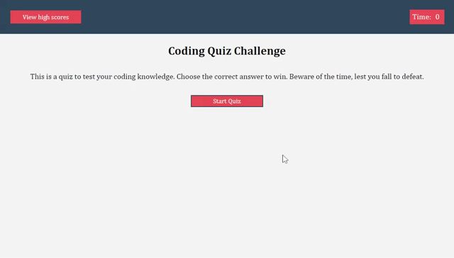

# Timed Coding Facts Quiz

## Description
This is a timed quiz to test the user's knowledge on coding facts. If the user guesses incorrectly, time is taken away. The total time left is the user's final score. The user is able to add their initials and see their high score. The user can also clear the high scores. This project uses HTML, CSS, and JavaScript. 

## Deployed Link
https://a-riveragonzalez.github.io/coding-timed-quiz/

## GitHub Repository
https://github.com/a-riveragonzalez/coding-timed-quiz

## Preview 

